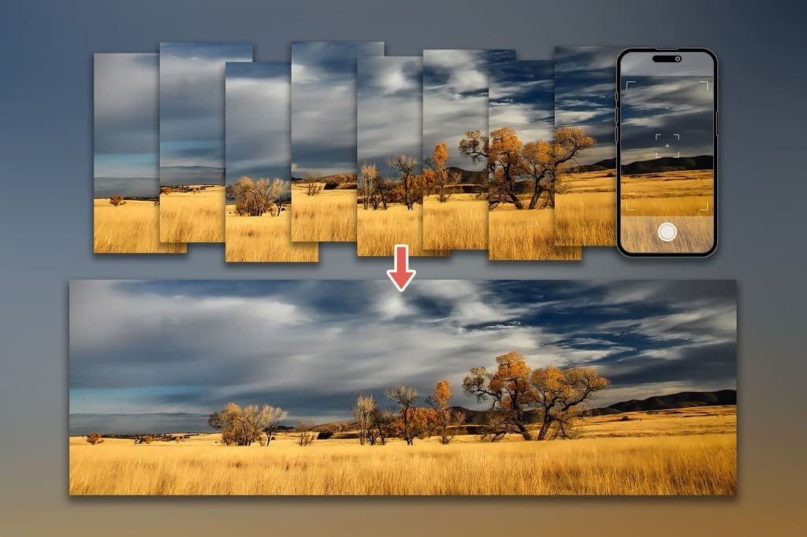

# Panorama Generation Project

Group G16 - Project P09

This repository contains the source code, data, and results for the CO5430 Computer Vision Semester Project: Panorama Generation from overlapping photos.

  

## Project Structure
- `src/`: Python source code and Jupyter Notebooks.
- `data/`: Custom datasets (overlapping photos). *Note: Large datasets should not be committed directly.*
- `results/`: Output panoramas, evaluation metrics, and plots.

## Setup
1. Clone the repository.
2. Install dependencies using `pip install -r requirements.txt` (to be added).

## Team Members - Group 16
- [E/22/054 - Danuja Nirodhana](https://people.ce.pdn.ac.lk/students/e22/054/)
- [E/22/184 - Bhagya Karunanayake](https://people.ce.pdn.ac.lk/students/e22/184/)
- [E/22/179 - Janith Kahagalla](https://people.ce.pdn.ac.lk/students/e22/179/)
- [E/22/205 - Ashen Kumarasinghe](https://people.ce.pdn.ac.lk/students/e22/205/)

## Dataset
 Dataset source: (https://sourceforge.net/adobe/adobedatasets/home/Home/)

## Workflow

## Results
